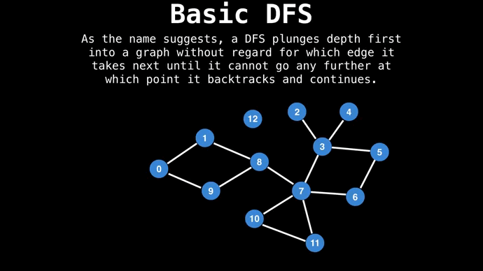

## Поиск в глубину


Задача дан **связный** граф нужно найти всех соседей

Алгоритм:
-  Будем помечать посещенные вершины
-  Стартуем с какой-то вершины, помечаем ее как посещенную
-  Находясь в очередной вершине храним текущий пройденный путь из начальной вершины
-  Перебираем соседей по очереди, пока не найдем не посещенную вершину
-  Если нашли, переходим в нее, помечаем ее как посещенную, добавляем ее в пройденный путь
-  Если не нашли, возвращаемся на одну вершину назад, в ней продолжаем искать непосещенного соседа (пройденный путь укорачивается на 1)
-  Когда вернемся в изначальную вершину, обход заканчивается

Данный алгоритм можно описать рекурсивно.

```
def Explore (v ):
    visited [v]=True 
    for u in graph[v]:
        if not visited[u]: 
            Explore (u)
```