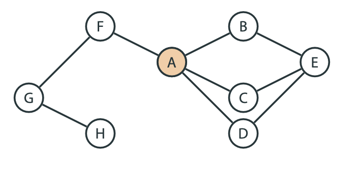
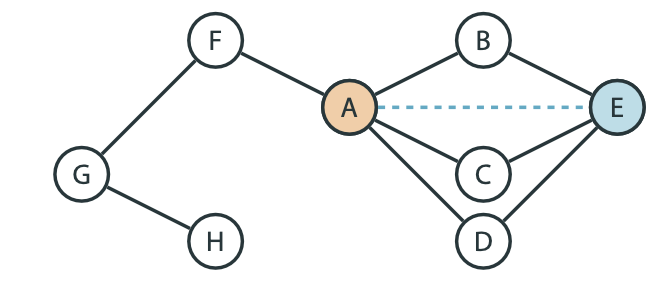

## Постановка задачи:

## Задача
Пусть 𝐺 — реальный граф из приложений. Какие ребра следует добавить к 𝐺?
- Задача звучит странно
- Не ясно, что это вообще значит и как отвечать на такой вопрос
- Но такие задачи реально возникают на практике
- Конкретная постановка зависит от контекста

### Пример: соцсети
- Дан граф соцсети
- Мы хотим предложить пользователю добавить друзей
- Хотим предложить тех, кого он скорее всего знает
- По сути хотим угадать, каких ребер не хватает в графе соцсети

###  Пример: рекомендация покупок
- В нашем онлайн магазине есть товары
- Мы знаем, какие товары часто покупают вместе
- Хотим понять, что еще можно предложить пользователям, которые купили какой-то товар
- Граф: соединяем ребрами те товары, которые часто покупают вместе
- По сути хотим угадать, каких ребер не хватает в графе

### Пример: рекомендация видео
- У нас есть видео сервис, на котором пользователи просматривают видео
- Мы знаем всю информацию о том, кто из пользователей что посмотрел
- Хотим рекомендовать пользователю новые видео
- Граф: соединяем ребрами пользователя с теми видео, которые он посмотрел
- По сути хотим угадать, каких ребер не хватает в графе

## Первая попытка решения
- Как же решать эту задачу?
- Рассмотрим пример соцсети
- Кого предложить в друзья пользователю 𝐴?

- ***Идея***: если у двух людей много общих друзей, они скорее всего знакомы
- Можно попробовать предлагать тех пользователей, которые с 𝐴 еще не друзья, но с которыми у 𝐴 больше всего общих друзей

### Тестирование

- Стандартный подход здесь такой
- Мы можем взять реальный граф
- Выберем в нем какую-то вершину
- Удалим несколько случайных ребер из нее
- А затем запустим наши методы на получившемся графе в этой вершине
- Мы знаем какие в реальности надо было бы провести ребра: те, которые мы удалили!
- И мы можем проверить, насколько близкий результат покажут наши методы