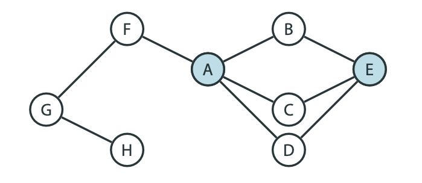

## Суть задачи такая-же как и в 4 пункте поиск/предсказание ближайших соседей в графе

- Случайные блуждания помогают анализировать окрестности объектов в графах
- Полезно, например, для кластеризации вершин
- Запускаем много случайных блужданий из вершины, обычно коротких
- Смотрим на список вершин, в которых закончились блуждания
- Сравниваем эти списки для разных вершин
- Это эффективнее, чем анализировать окрестности вершин полностью

Случаные блуждания
- Если есть граф, то близкие вершины это те, в которые есть короткий путь
- Но можно рассматривать другой тип близости: насколько быстро случайное блуждание приходит из одной вершины в другую

- Вершины могут быть далеки в обычном смысле
- Но если у вершин похожие окрестности, то случайное блуждание может заканчиваться быстро

- Пусть в графе 𝐺 выбраны две вершины 𝑢 и 𝑣
- Моментом достижения вершины 𝑣 из вершины 𝑢 называется ожидаемое число ходов случайного блуждания, стартующего из вершины 𝑢, до его попадания в вершину 𝑣
- Характеризует, насколько вершина 𝑣 близка к вершине 𝑢
- Минус: случайное блуждание может бесконечно долго не приходить в вершину 𝑣
- С этой величиной не очень удобно работать

### Будем применять усеченный момент достижения

**𝑇 -усеченным моментом достижения вершины** 𝑣 из вершины 𝑢 называется ожидаемое число ходов случайного блуждания длины 𝑇 , стартующего из вершины 𝑢, до его попадания в вершину 𝑣
