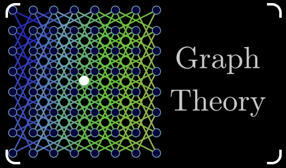
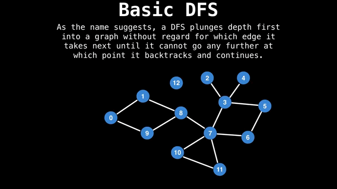

# Теория графов

Репозиторий с основными задачами алгоритм поиска в глубину, поиск циклов стоков в связных графах, также решена задача по нахождению близких соседей методом случайного блуждания и ближайших соседей
